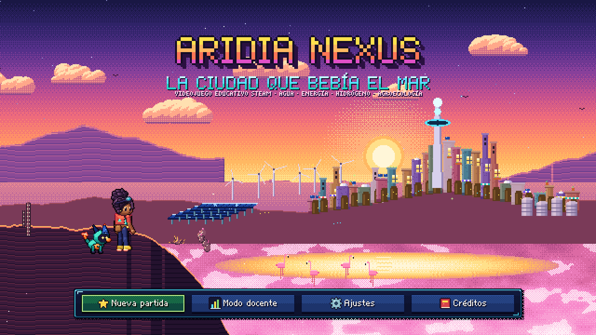
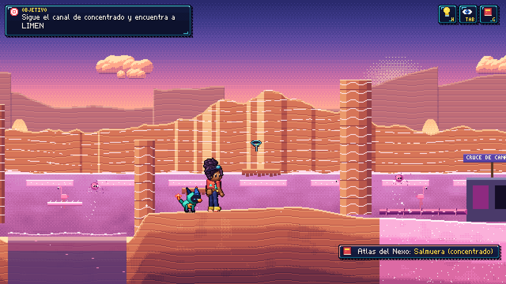
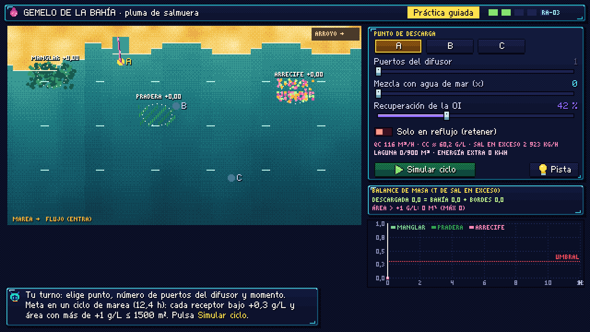
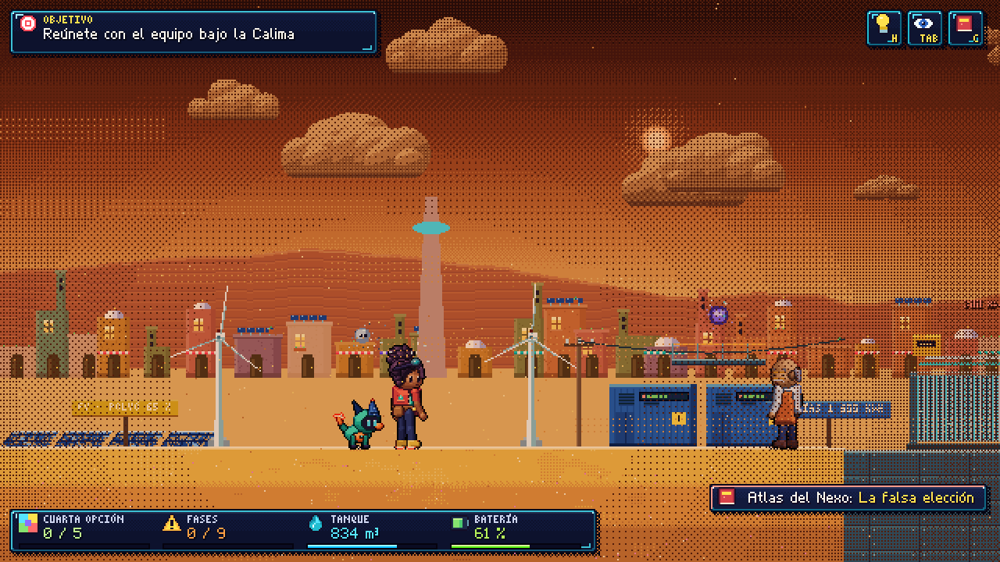
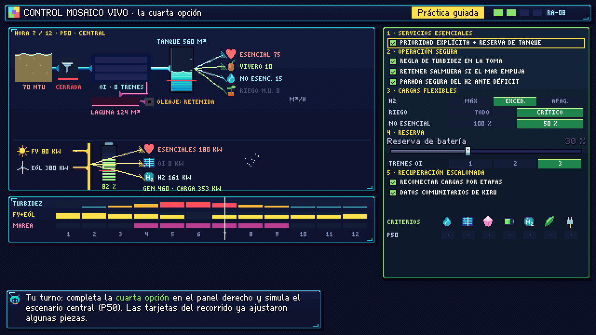

# ARIDIA NEXUS — La ciudad que bebía el mar

Videojuego educativo STEAM en **pixel art cinematográfico** sobre el nexo **agua – energía – hidrógeno – agroecología** en una costa árida. Todo el juego es un único archivo autocontenido: **`aridia_nexus.html`**. Funciona sin conexión, sin librerías, sin recursos externos y sin enviar datos a ningún servidor.



## Cómo jugar

1. Abre `aridia_nexus.html` en un navegador moderno (Chrome, Edge, Firefox o Safari). No necesita servidor ni instalación.
2. Elige **Nueva partida**. El audio se activa con la primera interacción.
3. El progreso se guarda en el navegador (`localStorage`, clave `aridiaNexusSave`).

| Acción | Teclado | Mando |
|---|---|---|
| Moverse | A / D o ← / → | Stick / cruceta |
| Saltar (mantener para planear con la Vela de Brisa) | Espacio / K | A |
| Interactuar | E / J | X |
| Herramienta activa | Q / L | B |
| Lente Nexo (flujos, unidades y límites) | N | Y |
| Tablero de evidencias | Tab | — |
| Atlas del Nexo (Codex) | C | Select |
| Pista | H | LB |
| Pausa | Esc / P | Start |

También admite ratón y pantallas táctiles (controles virtuales). Todos los controles se pueden reasignar en **Ajustes**, donde además hay opciones de accesibilidad: texto de diálogo amplio, velocidad y avance automático de diálogos, reducción de destellos y de sacudidas de cámara, alto contraste en gráficos, paleta para daltonismo (patrones en los flujos), modo sin límite de tiempo, anuncios para lector de pantalla y volúmenes por canal.

## La historia

Durante el Festival del Primer Agua, SYNARA —el sistema que convierte mar, sol y viento en agua, alimentos e hidrógeno— sufre un apagón. Todo apunta a **L.I.M.E.N.**, la inteligencia que cierra válvulas sin explicar. Amaya Serrano, su compañero robot **KIRU**, Naira y Dante recorren la isla y descubren que nadie es el único culpable: un contrato que exigía hidrógeno, datos comunitarios borrados como "ruido", mínimos simplificados y un gemelo digital, **MIRAGE**, que optimizaba una sola variable. En la **Gran Calima**, el jugador rechaza la falsa elección "agua, hidrógeno o cultivos", construye una cuarta opción y MIRAGE se transforma en **MOSAICO**, un gemelo digital que muestra incertidumbre y alternativas.

Hay **cuatro finales no punitivos** (Mosaico Resiliente, Pacto de Emergencia, Victoria Técnica y Deuda Ecológica), cada uno con debrief, un epílogo jugable —*La Primera Cosecha*— que cambia según el final, créditos y una escena poscréditos.

## Capítulos, simuladores y aprendizajes

Cada capítulo sigue el patrón pedagógico del documento maestro: fenómeno observable → pregunta → datos → ejemplo guiado → prueba del jugador → consecuencia visual → feedback causal → reintento o variante → transferencia. Cada simulador tiene cinco fases: **demostración, práctica guiada, práctica autónoma (guardián conceptual), transferencia y laboratorio libre**.

| Cap. | Título | RA | Simulador y núcleo científico | Herramienta |
|---|---|---|---|---|
| 00 | El Mapa del Nexo | RA-08 | Diagrama vivo del nexo: flujos, unidades, límites del sistema | Lente Nexo |
| 01 | La Boca del Mar | RA-01 | Captación y pretratamiento: turbidez, velocidad de aproximación, incertidumbre de medición | Barrido Sensorial |
| 02 | El Laberinto Osmótico | RA-02 | Ósmosis inversa: presión, recuperación, balance de sal, SEC, ensuciamiento, recuperador de energía | Tejedor de Presión |
| 03 | Los Cañones de Sal | RA-03 | Pluma de salmuera con marea: dilución, difusor, retención y balance de masa | Brújula de Salmuera |
| 04 | Las Dunas Fotónicas | RA-04 | Fotovoltaica: kW frente a kWh, polvo, nubes, despacho de cargas | Relé Solar |
| 05 | Las Torres de Brisa | RA-04 | Eólica: curva de potencia, estelas, ráfagas y corte por velocidad | Vela de Brisa |
| 06 | La Bóveda de Carga | RA-05 | Baterías: SOC, reserva, eficiencia, fallas encadenadas y arranque en negro | Cambio de Reserva |
| 07 | La Ciudadela del Hidrógeno | RA-06 | Electrólisis: agua ultrapura, excedente renovable, H2 "verde" y protocolo de seguridad abstracto | Sincronizador H2 |
| 08 | El Oasis de las Raíces | RA-07 | Riego agroecológico: mezcla de fuentes, salinidad del suelo, lavado y productividad hídrica | Mapa de Raíces |
| 09 | La Mesa del Nexo | RA-08 | Decisión multiobjetivo: dominancia de Pareto, índice único, contrato de H2 robusto | Tablero Mosaico |
| 10 | La Gran Calima | RA-08 | Control integrado del nexo hora a hora, robustez en escenarios P10/P50/P90 y transferencia nocturna | Control Mosaico Vivo |

El aprendizaje se registra con evidencias (RA-01 a RA-09), un modelo de dominio por concepto, la **taxonomía SOLO** y un **banco de 135 ítems** (diagnósticos, cálculos, diseño, debates y retos manipulativos). El **Atlas del Nexo** reúne más de 60 fichas con definición, variables, unidades, relaciones, ejemplo, límites, error frecuente y fuente.






## Veracidad científica y seguridad

- Los modelos son simplificaciones educativas declaradas. Las cifras de escenario están marcadas como **"supuesto de simulación para fines educativos"**; las cifras reales citan su fuente y año (FAO, IRENA, IEA, U.S. DOE, PNNL, IDEAM, UPME, Ministerio de Minas y Energía de Colombia, Elimelech y Phillip 2011, Voutchkov 2018, entre otras). La lista completa está en el Atlas y en los créditos.
- La seguridad del hidrógeno se trata solo como protocolo abstracto (**DETECTAR → AISLAR → DETENER → VENTILAR → VERIFICAR → AUTORIZAR REINICIO**). El juego no contiene instrucciones operativas peligrosas y siempre presenta como error desactivar sensores o saltarse protecciones.
- Ningún resultado constituye asesoría técnica, operativa ni financiera.

## Modo docente

Desde el título: **Modo docente**. Permite saltar a cualquier capítulo, ver la analítica de aprendizaje (dominio por concepto, SOLO, concepciones erróneas frecuentes, confianza frente a acierto) y exportarla en CSV o en un resumen de texto. El modo **Práctica** del mapa sugiere los conceptos más débiles del jugador y permite repasarlos con los retos y simuladores de cada capítulo.

## Desarrollo

El código fuente está en `src/` (JavaScript sin dependencias, Canvas 2D y Web Audio). Los módulos se concatenan en orden alfabético dentro de `src/template.html`:

```bash
node tools/build.js                  # genera aridia_nexus.html
node tests/models.test.js            # 77 pruebas de los modelos científicos
node tests/bank.test.js              # validación del banco de 135 ítems
node tests/calima.test.js            # diseño del modelo integrado de la Gran Calima
node tools/smoke.js                  # prueba de humo en navegador (requiere Playwright)
node tools/shot.js "test=level&lv=3&nocard=1&px=900" captura.png 2 1500
```

Parámetros de prueba útiles (solo para desarrollo): `?test=level&lv=N&px=X&nocard=1`, `?test=sim&lv=N&s=SimNN&phase=guided`, `?test=map`, `?test=scene&s=NombreEscena`.

| Archivo | Contenido |
|---|---|
| `00_core` – `07_state` | utilidades, pixel buffer y tramado, fuentes bitmap, audio procedural, entrada, motor de escenas, interfaz pixel, estado y guardado |
| `10_rig` – `16_biomes` | rig de personajes por capas, personajes y NPC, accesorios, fondos parallax, retratos 128 px, tecnología y biomas |
| `20_models` | modelos científicos (OI, salmuera, FV, eólica, BESS, H2, agro, microrred, multiobjetivo) y su validación |
| `21_learning` – `24_codex_more` | aprendizaje, SOLO, banco de preguntas, extras y Atlas del Nexo |
| `30_world` – `32_gameplay` | mundo de plataformas, historia y diálogos, escena de juego |
| `40_common`, `40_lv00` – `4a_lv10` | utilidades de nivel y los once capítulos con su guion y simulador |
| `4b_epilogue` | finales, epílogo, créditos finales y poscréditos |
| `50_scenes`, `51_teacher`, `99_main` | título, mapa, menús, ajustes, docente, práctica, créditos y arranque |

La dirección artística (pixel art de alto detalle, resolución lógica 640 × 360, escalado sin suavizado, 5–8 capas de parallax, iluminación y sombras tramadas, reflejos en el agua, partículas y paletas intensas) y el plan de trabajo están documentados en [`docs/DEV_PLAN.md`](docs/DEV_PLAN.md).
